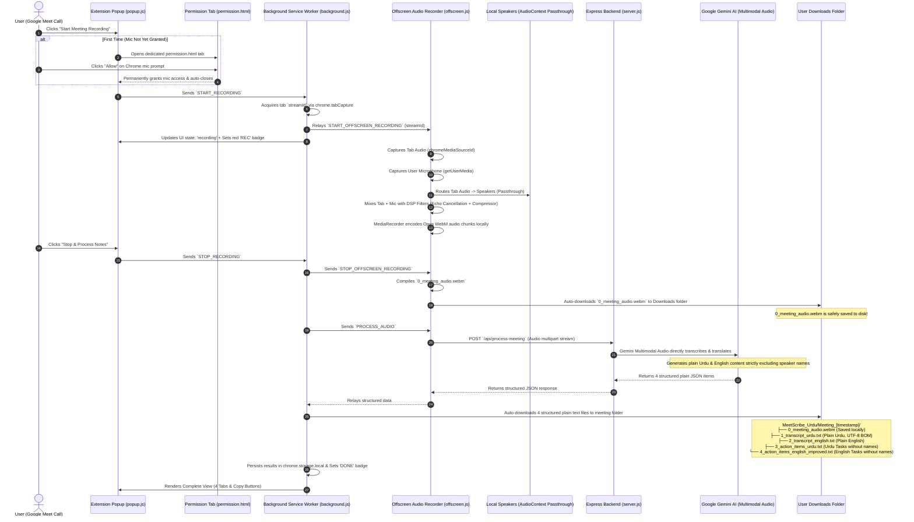

# MeetScribe Urdu — Architecture & End-to-End Workflow

This document details the complete end-to-end operational lifecycle, dual-channel audio recording preservation, direct multimodal AI processing via Express.js backend, and bilingual plain text generation of **MeetScribe Urdu**.

---

## 1. High-Level Architecture Diagram

---

## 2. Step-by-Step Lifecycle Breakdown

### Phase 1: Initiation
1. **Google Meet Validation**: [`popup.js`](file:///home/abhishek/Desktop/Work/MeetScribe%20Urdu/meet-scribe-extension/extension/popup.js) validates that the active tab is `meet.google.com`.
2. **Audio Capture Initialization**: Background acquires `streamId` via `chrome.tabCapture` and initializes the offscreen audio engine.

---

### Phase 2: Dual-Channel Audio Mixing & Instant Local Preservation
1. **Dual Capture**: [`offscreen.js`](file:///home/abhishek/Desktop/Work/MeetScribe%20Urdu/meet-scribe-extension/extension/offscreen.js) captures Google Meet tab audio (all remote attendees) + user microphone.
2. **Audio Passthrough**: Tab audio is connected to `audioContext.destination` so you hear all participants clearly.
3. **DSP Processing**: High-pass filter (85Hz) and Broadcast Dynamics Compressor clean up microphone pops and normalize volume.
4. **Instant Local Download**: When recording stops, `0_meeting_audio.webm` is compiled and downloaded immediately to `Downloads/MeetScribe_Urdu/Meeting_[timestamp]/`.

---

### Phase 3: Express Backend & Direct Multimodal Audio AI Processing
1. **Direct Audio Input**: The compiled audio recording is transmitted directly to the Express.js backend at `/api/process-meeting`.
2. **Gemini Multimodal Audio**: Google Gemini (`gemini-3.6-flash`, or the configured `GEMINI_MODEL`) listens directly to the audio recording.
3. **Plain Content Generation (No Speaker Names)**:
   - All speaker names, labels, and tags (e.g., `[Speaker]:`, `[Name]:`, `[Person]:`) are strictly excluded.
   - Transcripts are formatted into clean, readable paragraphs with natural punctuation.
   - Action items are extracted as clean bullet points without person assignments.
4. **Groq Whisper Fallback**: If Gemini direct audio is unavailable, Groq Whisper Large v3 transcribes the audio, and the text is structured into the 4 plain items.

---

### Phase 4: Download Organization & Popup Display
1. The extension automatically downloads the audio file plus 4 structured plain UTF-8 text files:
   - `0_meeting_audio.webm` (Local audio recording)
   - `1_transcript_urdu.txt` (Urdu transcript without speaker names, UTF-8 BOM)
   - `2_transcript_english.txt` (English translation without speaker names)
   - `3_action_items_urdu.txt` (Urdu action items without person names)
   - `4_action_items_english_improved.txt` (Executive English action items without person names)
2. Results are rendered in the popup with 4 interactive tabs and one-click clipboard copying.
