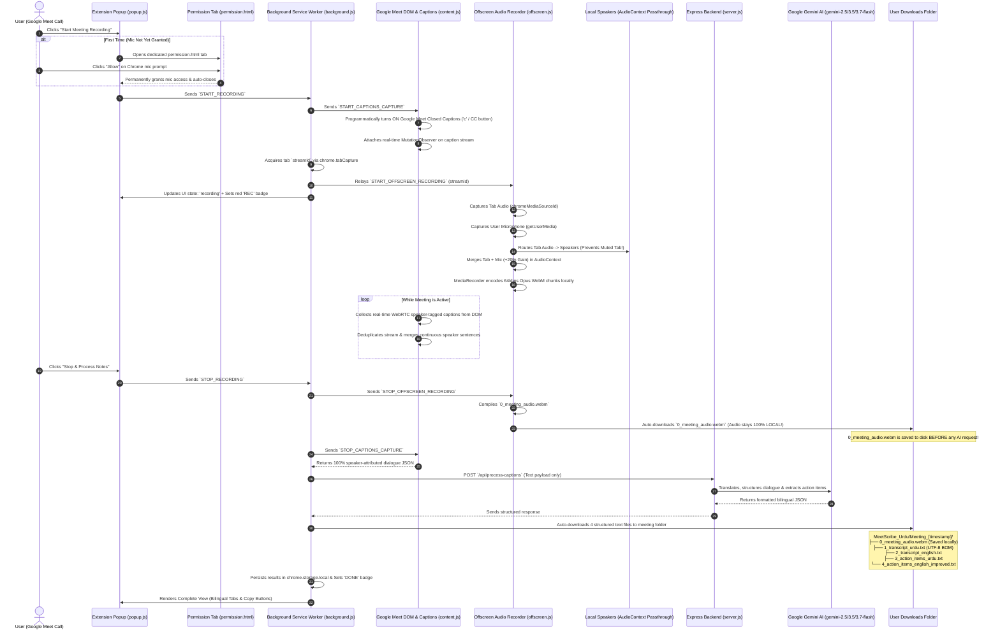

# MeetScribe Urdu — Architecture & End-to-End Workflow

This document details the complete end-to-end operational lifecycle, communication protocols, 100% ground-truth closed captions extraction, local audio recording preservation, and Express.js backend architecture of **MeetScribe Urdu**.

---

## 1. High-Level Architecture Diagram

---

## 2. Step-by-Step Lifecycle Breakdown

### Phase 1: Initiation & Google Meet CC Auto-Enable
1. **Google Meet Validation**: [`popup.js`](file:///home/abhishek/Desktop/Work/MeetScribe%20Urdu/meet-scribe-extension/extension/popup.js) validates that the active tab is `meet.google.com`.
2. **Auto-Enabling Captions**: When recording starts, [`content.js`](file:///home/abhishek/Desktop/Work/MeetScribe%20Urdu/meet-scribe-extension/extension/content.js) automatically enables Closed Captions (CC) in Google Meet by clicking the CC button or dispatching the `c` shortcut.
3. **DOM MutationObserver**: Real-time caption mutations are observed, capturing the exact Google Meet profile name (e.g., `Shoaib Shah`, `Abhishek Kamyani`) and streaming text.

---

### Phase 2: Dual-Channel Audio Mixing & Instant Local Preservation
1. **Dual Capture**: [`offscreen.js`](file:///home/abhishek/Desktop/Work/MeetScribe%20Urdu/meet-scribe-extension/extension/offscreen.js) captures Google Meet tab audio + user microphone.
2. **Audio Passthrough**: Tab audio is connected to `audioContext.destination` to ensure you hear all participants clearly.
3. **Instant Local Download**: When recording stops, `0_meeting_audio.webm` is downloaded immediately to `Downloads/MeetScribe_Urdu/Meeting_[timestamp]/` **before** any AI or backend request is sent.
4. **Zero Audio Upload**: Audio files are never transmitted over the network, ensuring 100% privacy and zero upload latency.

---

### Phase 3: Express Backend & Google Gemini AI Processing
1. **Payload**: Ground-truth speaker-tagged caption text is sent to the Express.js backend at `/api/process-captions`.
2. **Google Gemini Structuring**: Gemini formats the dialogue, provides high-fidelity Urdu and English translations, and extracts concrete action items assigned directly to the verified speaker names.
3. **Linguistic Guardrails**: Explicit anti-Arabic prompting ensures authentic Pakistani/Indian corporate Urdu vocabulary (`ہیلو`, `السلام علیکم`, `اپ ڈیٹ`, `بٹن`, `پیج`).

---

### Phase 4: Download Organization & Popup Display
1. The extension downloads 4 structured UTF-8 text files alongside the local audio file:
   - `0_meeting_audio.webm` (Local audio recording)
   - `1_transcript_urdu.txt` (Urdu transcript in UTF-8 BOM)
   - `2_transcript_english.txt` (English translation)
   - `3_action_items_urdu.txt` (Urdu action items)
   - `4_action_items_english_improved.txt` (Executive English action items)
2. Results are rendered in the popup with 4 interactive tabs and one-click clipboard copying.
