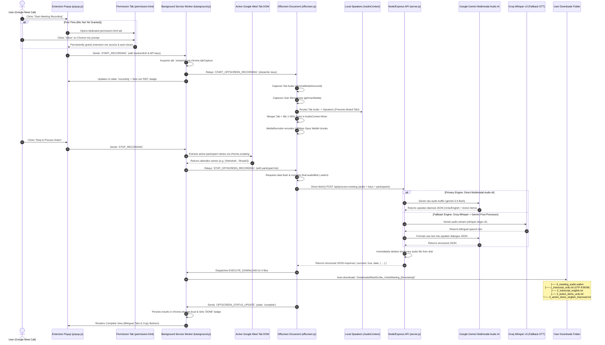

# MeetScribe Urdu — Architecture & End-to-End Workflow

This document details the complete end-to-end operational lifecycle, communication protocols, multi-engine AI architecture, and audio mixing pipeline of **MeetScribe Urdu**.

---

## 1. High-Level Architecture Diagram



---

## 2. Step-by-Step Lifecycle Breakdown

### Phase 1: Initiation, Validation & BYOK Setup
1. **Google Meet Validation**: [`popup.js`](file:///home/abhishek/Desktop/Work/MeetScribe%20Urdu/meet-scribe-extension/extension/popup.js) inspects the active tab. If the URL is not `meet.google.com`, recording is disabled and a helpful alert banner is displayed.
2. **Bring Your Own Key (BYOK)**:
   - Users enter their free **Groq** and **Google Gemini** API keys in the ⚙️ Settings drawer.
   - Keys are stored privately in `chrome.storage.local`.
   - Dynamic validation ensures recording only begins when keys are configured.
3. **Backend Health Check**:
   - `popup.js` pings `GET /api/health` across ports `3000`/`3001` or the deployed cloud URL.
   - Shows **🟢 Online** status when the server is reachable and keys are configured.

---

### Phase 2: Chrome Microphone Permission Handling
*To solve the ephemeral popup cut-off in Chrome extensions:*
1. When microphone access is first required, [`popup.js`](file:///home/abhishek/Desktop/Work/MeetScribe%20Urdu/meet-scribe-extension/extension/popup.js) opens a dedicated tab: [`permission.html`](file:///home/abhishek/Desktop/Work/MeetScribe%20Urdu/meet-scribe-extension/extension/permission.html).
2. Chrome displays the native `"Allow MeetScribe Urdu to use your microphone: [Allow]"` prompt.
3. Once allowed, [`permission.js`](file:///home/abhishek/Desktop/Work/MeetScribe%20Urdu/meet-scribe-extension/extension/permission.js) saves permission permanently and auto-closes the tab.

---

### Phase 3: Dual-Channel Web Audio Mixing (Tab + Microphone)
To capture both remote attendees and the local speaker without muting the tab:

```
[ Google Meet Tab Audio ] ──► [ TabSource ] ──┬──► [ Local Speakers (AudioContext.destination) ]
                                              │     (Attendee audio stays audible to user)
                                              ▼
                                      [ Web Audio Mixer ] ──► [ MediaRecorder (128kbps Opus) ]
                                              ▲
[ User's Microphone ]     ──► [ MicSource ] ──┴──► [ GainNode (+30% Boost) ]
                                                    (Mic is NOT looped to speakers to avoid echo!)
```

1. **Tab Capture**: `chrome.tabCapture.getMediaStreamId()` grabs remote attendee voices.
2. **Microphone Capture**: `navigator.mediaDevices.getUserMedia({ audio: true })` captures local user speech with noise suppression and acoustic gain.
3. **Web Audio Mixer**: [`offscreen.js`](file:///home/abhishek/Desktop/Work/MeetScribe%20Urdu/meet-scribe-extension/extension/offscreen.js) mixes both streams into `AudioContext.createMediaStreamDestination()` with `+30%` gain on the mic.
4. **Zero Tab Muting**: Tab audio is routed to `activeAudioContext.destination` so you hear meeting participants normally.
5. **High-Definition Encoding**: Encoded at **128 kbps Opus** inside a `.webm` container.

---

### Phase 4: Google Meet Attendee Extraction & 30s Timeout Bypass
1. **Participant Extraction**:
   - When the user clicks **"Stop & Process Notes"**, [`background.js`](file:///home/abhishek/Desktop/Work/MeetScribe%20Urdu/meet-scribe-extension/extension/background.js) runs `chrome.scripting.executeScript` to extract active attendee names (e.g., `["Abhishek Raj", "Shoaib", "Sahil"]`) directly from Google Meet's DOM.
2. **Buffer Flushing**:
   - `mediaRecorder.requestData()` flushes all buffered audio chunks before closing the audio graph.
3. **Direct Upload (Bypassing SW 30s Timeout)**:
   - [`offscreen.js`](file:///home/abhishek/Desktop/Work/MeetScribe%20Urdu/meet-scribe-extension/extension/offscreen.js) directly executes `fetch()` `POST` to `/api/process-meeting` with:
     - `FormData`: `audio` (.webm), `participants` (JSON string), `groqApiKey`, `geminiApiKey`
     - Headers: `X-Groq-API-Key`, `X-Gemini-API-Key`

---

### Phase 5: Dual-Engine AI Processing Pipeline

[`server.js`](file:///home/abhishek/Desktop/Work/MeetScribe%20Urdu/meet-scribe-extension/backend/server.js) runs an intelligent dual-engine architecture:

#### 1. Primary Engine: Google Gemini Direct Multimodal Audio AI
- **Model**: `gemini-3.5-flash` / `gemini-flash-latest`
- **Mechanism**: Passes raw `.webm` audio buffer directly via `inlineData: { mimeType: 'audio/webm' }`.
- **Why It's Superior**:
  - Listens directly to sound waves, accents, speaker vocal differences, and English tech terms (e.g. *API, UI, Button, Endpoint, Deployment*).
  - Eliminates speech-to-text translation loss.
  - Generates speaker-attributed conversation turns mapped to Google Meet attendee names.

#### 2. Secondary Engine: Groq Whisper STT + Gemini Post-Processor (Fallback)
- **STT Model**: Groq `whisper-large-v3` with dynamic bilingual prompt (no hardcoded language lock to prevent phonetic garbling).
- **Post-Processor**: Gemini structures the raw transcript into speaker dialogue and actionable tasks.

#### 3. Strict Urdu Linguistic Guardrails (Zero Hallucination)
- Strict rules ban Arabic phrase substitutions (`مرحبا`, `بارک اللہ`).
- Preserves authentic spoken conversational Urdu (مثلاً: *ہیلو، السلام علیکم، کیا حال ہے، کام، بٹن، یو آئی، اپ ڈیٹ*) and English.
- Output JSON Schema:
  ```json
  {
    "transcript_urdu": "ابھیشیک: ہیلو شعیب، کیا حال ہے؟\nشعیب: میں ٹھیک ہوں، پروجیکٹ کا کام مکمل ہو گیا۔",
    "transcript_english": "Abhishek: Hello Shoaib, how are you?\nShoaib: I am good, the project work is complete.",
    "action_items_urdu": "• ابھیشیک: ویب پیج پر بٹن کا لے آؤٹ درست کرنا۔",
    "action_items_english_improved": "• Abhishek: Fix the button layout on the web page."
  }
  ```

---

### Phase 6: Automated Meeting Subfolder Downloads

All 5 output files are automatically saved inside a dedicated meeting folder inside the user's Downloads directory:

```text
📁 Downloads/
   └── 📁 MeetScribe_Urdu/
       └── 📁 Meeting_YYYY-MM-DD_HH-MM/
           ├── 🎵 0_meeting_audio.webm              (Complete 2-way meeting recording)
           ├── 📝 1_transcript_urdu.txt             (Verbatim Urdu dialogue with UTF-8 BOM)
           ├── 📝 2_transcript_english.txt          (Accurate English translation dialogue)
           ├── 📝 3_action_items_urdu.txt           (Urdu tasks with assigned person names)
           └── 📝 4_action_items_english_improved.txt (Business English action items with owners)
```

1. **Native Chrome Downloads**: Triggered via `chrome.downloads.download({ filename: 'MeetScribe_Urdu/Meeting_.../file.txt' })`.
2. **UTF-8 BOM (`\uFEFF`)**: Embedded in all text files to ensure Urdu Nastaliq calligraphy renders in Windows Notepad, macOS TextEdit, Linux, and mobile devices without encoding errors.
3. **In-Popup Live Preview**: Complete view in `popup.html` provides 4 tabbed bilingual views with one-click clipboard copying.

---

## 3. Summary of Component Roles

| File | Context | Key Responsibilities |
|---|---|---|
| [`manifest.json`](file:///home/abhishek/Desktop/Work/MeetScribe%20Urdu/meet-scribe-extension/extension/manifest.json) | Configuration | Declares permissions (`tabCapture`, `scripting`, `offscreen`, `storage`, `downloads`, `activeTab`), host permissions, background worker, and popup. |
| [`popup.html`](file:///home/abhishek/Desktop/Work/MeetScribe%20Urdu/meet-scribe-extension/extension/popup.html) / [`popup.css`](file:///home/abhishek/Desktop/Work/MeetScribe%20Urdu/meet-scribe-extension/extension/popup.css) | Popup UI | Dark-mode interface, Google Meet tab validation, API key inputs with password mask/reveal, live soundwave, timer, and tabbed previews. |
| [`popup.js`](file:///home/abhishek/Desktop/Work/MeetScribe%20Urdu/meet-scribe-extension/extension/popup.js) | Popup Logic | Coordinates user actions, verifies mic permission, loads/saves BYOK API keys, pings backend health, and handles clipboard copy. |
| [`permission.html`](file:///home/abhishek/Desktop/Work/MeetScribe%20Urdu/meet-scribe-extension/extension/permission.html) / [`permission.js`](file:///home/abhishek/Desktop/Work/MeetScribe%20Urdu/meet-scribe-extension/extension/permission.js) | Permission Tab | Full-tab microphone permission grant page that avoids popup cut-off issues in Chrome. |
| [`background.js`](file:///home/abhishek/Desktop/Work/MeetScribe%20Urdu/meet-scribe-extension/extension/background.js) | Service Worker | Acquires `tabCapture` stream ID, extracts Google Meet attendee names from DOM, manages toolbar badges (`REC`/`DONE`/`ERR`), and executes subfolder downloads. |
| [`offscreen.js`](file:///home/abhishek/Desktop/Work/MeetScribe%20Urdu/meet-scribe-extension/extension/offscreen.js) | Offscreen Window | Web Audio mixer (Tab + Mic with Gain), audio passthrough (anti-muting), MediaRecorder 128kbps Opus, direct `fetch()` to backend, and download dispatching. |
| [`server.js`](file:///home/abhishek/Desktop/Work/MeetScribe%20Urdu/meet-scribe-extension/backend/server.js) | Express Server | Multer file intake, Gemini Direct Multimodal Audio AI pipeline, Groq Whisper fallback, anti-Arabic Urdu linguistic rules, speaker diarization, and temp file cleanup. |
