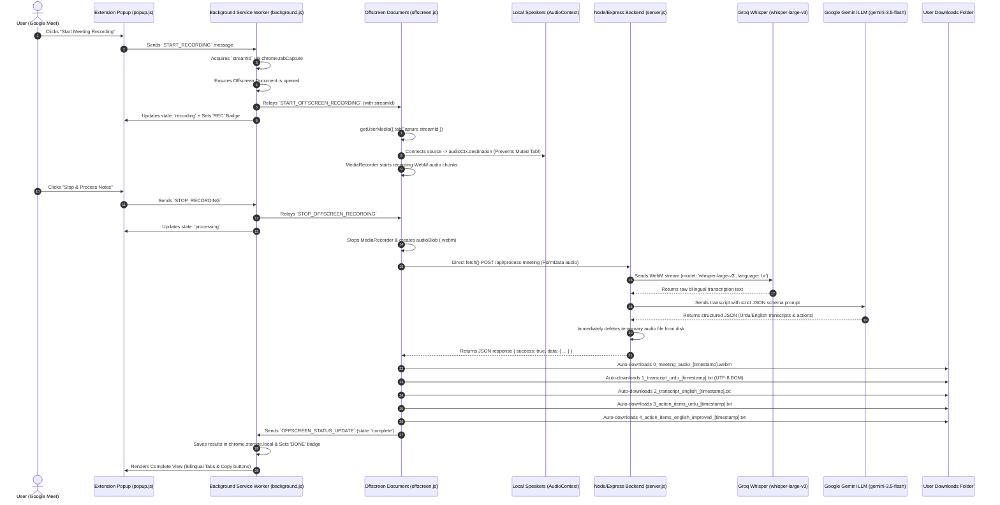

# MeetScribe Urdu — Architecture & End-to-End Workflow

This document details the complete end-to-end operational lifecycle, communication protocols, and AI pipeline of **MeetScribe Urdu**.

---

## 1. High-Level Architecture Diagram



---

## 2. Step-by-Step Lifecycle Breakdown

### Phase 1: Initiation & Validation
1. **User Action**: The user is inside a Google Meet call (`https://meet.google.com/*`) and opens the MeetScribe Urdu popup.
2. **Tab Check (`popup.js`)**: Validates the current tab URL. If the user is not on Google Meet, an alert banner is displayed and recording is disabled.
3. **Backend Health Check**: `popup.js` queries `http://localhost:3000/api/health` (or `3001`). If reachable, it shows an **Online** status badge.
4. **Trigger**: When the user clicks **"Start Meeting Recording"**, `popup.js` starts a local timer and dispatches `START_RECORDING` to `background.js`.

---

### Phase 2: Tab Capture & Offscreen Setup
1. **Stream ID Generation (`background.js`)**:
   - Calls `chrome.tabCapture.getMediaStreamId({ targetTabId })` to generate a secure tab capture handle.
2. **Offscreen Document Lifecycle (`background.js`)**:
   - Opens `offscreen.html` via `chrome.offscreen.createDocument({ reasons: [chrome.offscreen.Reason.USER_MEDIA] })`.
   - Sends `START_OFFSCREEN_RECORDING` with the `streamId` to the offscreen document.
   - Sets the red **REC** badge on the extension toolbar icon.

---

### Phase 3: Audio Passthrough & Recording (`offscreen.js`)
1. **Media Stream Intake**: `navigator.mediaDevices.getUserMedia` uses the tab stream ID to capture high-fidelity meeting audio.
2. **The Audio Passthrough (Muted Tab Trap Prevention)**:
   ```javascript
   const audioCtx = new AudioContext();
   const source = audioCtx.createMediaStreamSource(stream);
   source.connect(audioCtx.destination);
   ```
   *Why this is critical:* Without this line, Chrome completely mutes the Google Meet tab for the user during recording. Connecting to `destination` routes the meeting audio back to the user's speakers in real-time.
3. **MediaRecorder Encoding**: Audio is recorded in 1-second timeslices using Opus compression in a `.webm` container.

---

### Phase 4: Direct Backend Upload & 30s Timeout Bypass
1. **Stop Trigger**: When the user clicks **"Stop & Process Notes"**, `offscreen.js` finalizes the `audioBlob`.
2. **Direct Upload**:
   - Instead of routing the large audio file through `background.js` (which can terminate after 30 seconds of inactivity in Manifest V3), `offscreen.js` executes the `fetch()` `POST` request directly to `http://localhost:3000/api/process-meeting`.

---

### Phase 5: Backend AI Pipeline (`server.js`)
1. **Intake (`multer`)**: Receives the multipart form data and saves the audio temporarily in `backend/temp_recordings/`.
2. **Step 1 — Groq Whisper STT**:
   - Reads the `.webm` file stream and sends it to Groq's `whisper-large-v3` with `language: 'ur'`.
   - Returns ultra-fast, high-accuracy raw bilingual Urdu/English speech text.
3. **Step 2 — Google Gemini Bilingual Structuring**:
   - Sends the raw transcript to Gemini (`gemini-3.5-flash` / `gemini-3.6-flash`).
   - The system prompt enforces strict JSON formatting adhering to this schema:
     ```json
     {
       "transcript_urdu": "Full verbatim Urdu script transcript.",
       "transcript_english": "Accurate End-to-End English translation.",
       "action_items_urdu": "Bullet-point list of tasks in Urdu.",
       "action_items_english_improved": "Grammatically polished English business action items."
     }
     ```
4. **Step 3 — Cleanup**: In a `finally` block, the backend deletes the temporary `.webm` file from the server.

---

### Phase 6: Automatic File Generation & Downloads
1. **Direct DOM Downloads (`offscreen.js`)**:
   Upon receiving the JSON response, `offscreen.js` automatically creates blob URLs and triggers downloads for **5 distinct files**:
   - `0_meeting_audio_[timestamp].webm` (The exact raw recorded meeting audio)
   - `1_transcript_urdu_[timestamp].txt` (Verbatim Urdu script)
   - `2_transcript_english_[timestamp].txt` (English translation)
   - `3_action_items_urdu_[timestamp].txt` (Urdu action items)
   - `4_action_items_english_improved_[timestamp].txt` (Business English action items)
2. **Unicode Nastaliq Rendering**:
   All text files are encoded with UTF-8 BOM (`\uFEFF`) and `text/plain;charset=utf-8` to ensure Windows Notepad, macOS, Linux, and mobile text viewers render Arabic/Urdu Nastaliq characters without mojibake.
3. **UI Preview & State Persistence**:
   - `background.js` persists the results in `chrome.storage.local` and changes the badge to **DONE**.
   - `popup.html` renders the Complete view with tabbed bilingual switching and copy-to-clipboard buttons.

---

## 3. Summary of Component Roles

| File | Context | Key Responsibilities |
|---|---|---|
| [`manifest.json`](file:///home/abhishek/Desktop/Work/MeetScribe%20Urdu/meet-scribe-extension/extension/manifest.json) | Configuration | Declares permissions (`tabCapture`, `offscreen`, `storage`, `downloads`, `activeTab`), host permissions, background worker, and popup. |
| [`popup.html`](file:///home/abhishek/Desktop/Work/MeetScribe%20Urdu/meet-scribe-extension/extension/popup.html) / [`popup.css`](file:///home/abhishek/Desktop/Work/MeetScribe%20Urdu/meet-scribe-extension/extension/popup.css) | Popup UI | Dark-mode interface, Google Meet tab validation banner, live waveform animation, timer, tabbed bilingual previews. |
| [`popup.js`](file:///home/abhishek/Desktop/Work/MeetScribe%20Urdu/meet-scribe-extension/extension/popup.js) | Popup Logic | Coordinates user actions, checks backend health (`GET /api/health`), handles tab switching and clipboard copy. |
| [`background.js`](file:///home/abhishek/Desktop/Work/MeetScribe%20Urdu/meet-scribe-extension/extension/background.js) | Service Worker | Acquires `tabCapture` stream ID, opens offscreen document with strict enum (`Reason.USER_MEDIA`), updates badge (`REC`/`DONE`/`ERR`). |
| [`offscreen.js`](file:///home/abhishek/Desktop/Work/MeetScribe%20Urdu/meet-scribe-extension/extension/offscreen.js) | Offscreen Window | MediaRecorder, Web Audio passthrough, direct `fetch()` to backend, and triggers 5 file downloads. |
| [`server.js`](file:///home/abhishek/Desktop/Work/MeetScribe%20Urdu/meet-scribe-extension/backend/server.js) | Express Server | Multer file upload, Groq Whisper Urdu STT, Google Gemini JSON structuring, temp file cleanup, auto-port fallback. |
